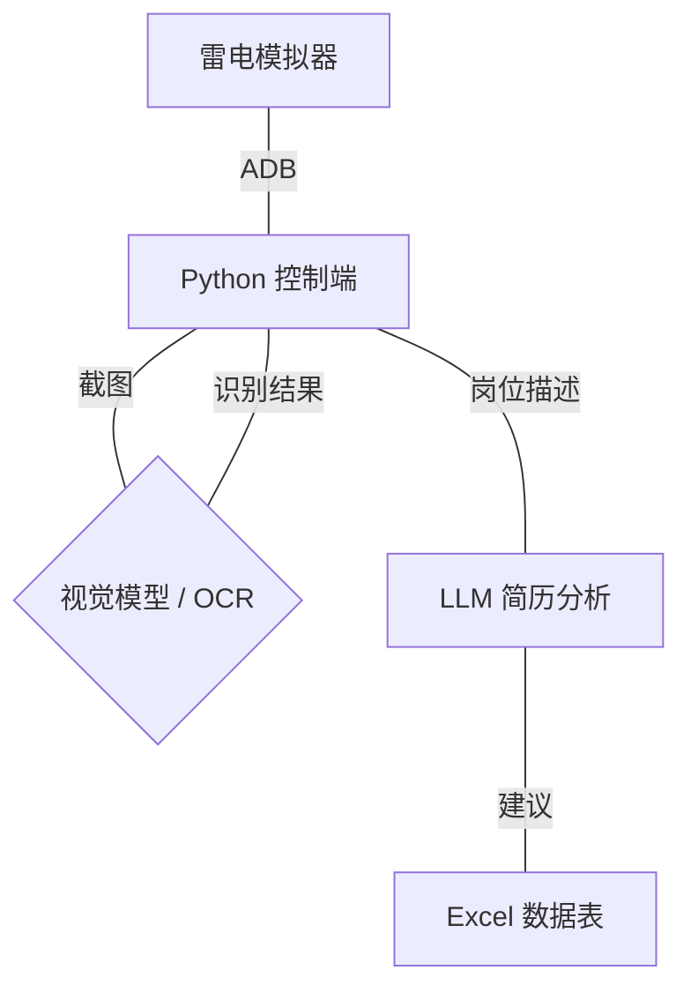

# Job-Hunting-Assistant: 自动求职助手 (Vision + ADB)

这是一个基于视觉方案和 ADB 自动化脚本的辅助工具，旨在自动化处理 Boss直聘、智联招聘、猎聘等招聘平台的岗位筛选与匹配。

## 核心能力
- **模拟操作**：通过 ADB 连接雷电模拟器，实现点击、输入、无限滚动。
- **视觉驱动**：支持本地视觉模型对屏幕进行语义解析。
- **简历洞察**：根据 PDF 简历内容，自动判断岗位匹配度（高/中/低）并给出理由。
- **数据汇总**：将感兴趣的岗位信息导出至本地表格。

## 系统架构

## 技术栈
- **语言**: Python 3.10
- **工具**: 
    - [LDPlayer (雷电模拟器)](https://www.ldplayer.net/)
    - [ADB (Android Debug Bridge)](https://developer.android.com/studio/releases/platform-tools)
- **视觉/AI**:
    - 本地推理: `ollama` / `MiniCPM-V`
    - OCR: `PaddleOCR`
    - 分析: `Llama-3-Vision` (本地) 或 API (如 DeepSeek/GPT)

## 开始使用
请参考 [环境搭建指南](./env_setup.md) 进行初始化。
