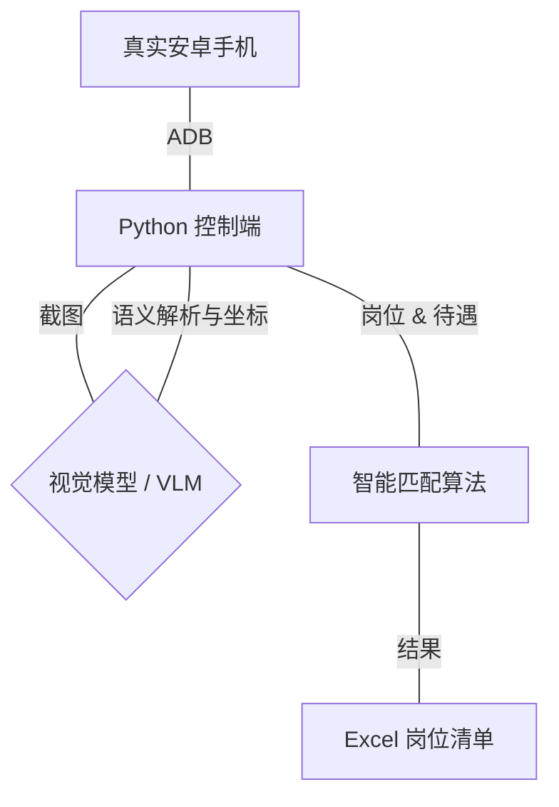

# Job-Hunting-Assistant: 视觉驱动真实安卓设备自动求职助手

这是一个基于视觉方案和 ADB 自动化脚本的辅助工具，旨在自动化处理 Boss直聘、智联招聘、猎聘等招聘平台的岗位筛选与匹配。本项目采用**视觉模型（Vision Model）**指导控制**真实安卓设备**，实现智能化的职位搜索与筛选。

## 核心能力
- **视觉指导控制**：通过视觉模型解析屏幕，智能导航并操作招聘 App。
- **精准搜索**：根据用户期望的岗位和背景，在多个平台自动进行针对性搜索。
- **待遇筛选**：自动识别招聘信息中的薪资福利，过滤不符合待遇要求的岗位。
- **数据汇总**：将符合条件的优质岗位信息自动导出至本地 Excel 表格，方便查阅。
- **真实设备支持**：通过 ADB 连接真实安卓手机，操作更接近真实用户行为，更具稳定性。

## 系统架构

## 技术栈
- **语言**: Python 3.10
- **连接**: [ADB (Android Debug Bridge)](https://developer.android.com/studio/releases/platform-tools)
- **视觉/AI**:
    - 本地推理: `Ollama` (Llava/Llama-3-Vision) / `qwen-vl`
    - 解析: 多模态视觉大模型 (VLM)
- **数据管理**: `Pandas`, `openpyxl`

## 开始使用
请参考 [环境搭建指南](./env_setup.md) 进行初始化。
1. 连接安卓手机并开启 USB 调试。
2. 配置 `config.yaml` 中的期望岗位与待遇。
3. 运行 `main.py` 开始自动化搜索。
